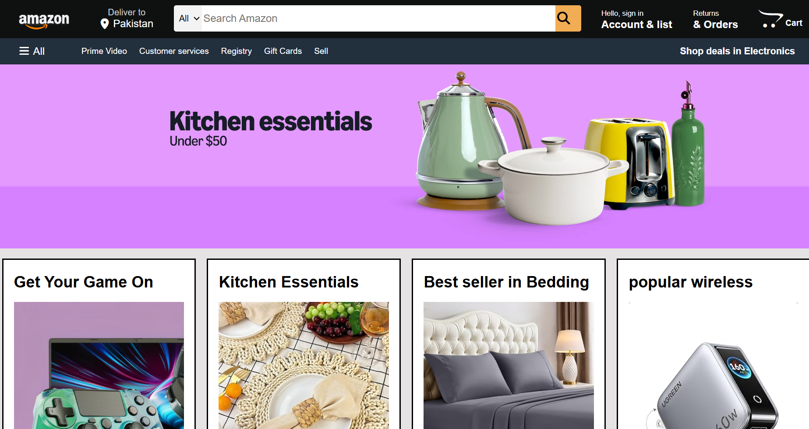

# Amazon Clone

A frontend practice project inspired by the Amazon website, built using HTML and CSS.

This project focuses on recreating the structure and visual layout of an e-commerce homepage while strengthening practical skills in HTML structure, CSS styling, layouts, navigation, and webpage organization.

## Project Overview

The Amazon Clone is a static frontend implementation that recreates key sections of an Amazon-inspired e-commerce homepage.

The project was developed as part of my learning journey in web development and to gain hands-on experience transforming a website design into a functional webpage using HTML and CSS.
## Project Preview



## Features

- Amazon-inspired navigation bar
- Logo and search interface
- Account and shopping cart sections
- Hero/banner section
- Product and category sections
- Image-based product cards
- Footer section
- CSS-based layouts and styling
- Organized HTML structure

## Technologies Used

- **HTML5** — Page structure and content
- **CSS3** — Styling, layout, spacing, and visual design

## Learning Objectives

Through this project, I practiced:

- Structuring webpages with HTML
- Creating layouts using CSS
- Working with images and backgrounds
- Styling navigation bars and content sections
- Managing spacing, dimensions, and positioning
- Organizing frontend project files
- Using Git and GitHub for version control

## Project Structure

```text
amazon-clone/
│
├── index.html
├── style.css
│
├── amazon-logo.jpg
├── hero-image.jpg
├── IMAGE1.jpg
├── IMAGE2.jpg
├── IMAGE3.jpg
├── IMAGE4.jpg
├── IMAGE5.jpg
├── IMAGE6.jpg
├── IMAGE7.jpg
└── IMAGE8.jpg
